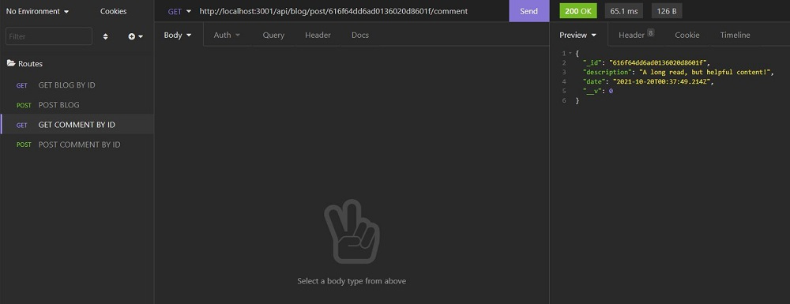
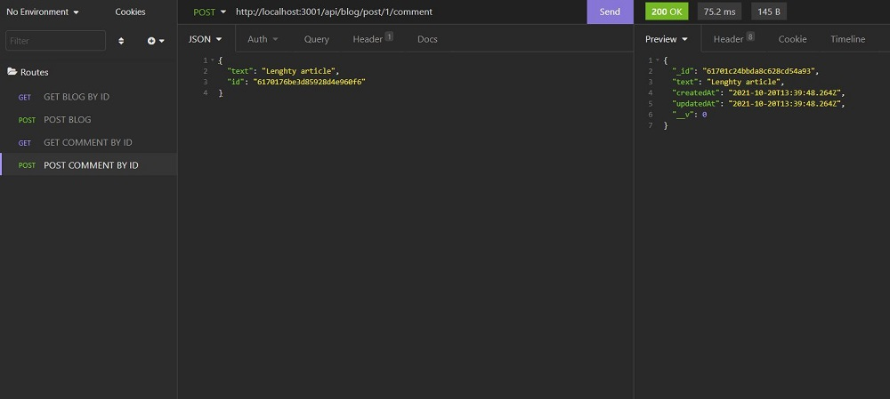
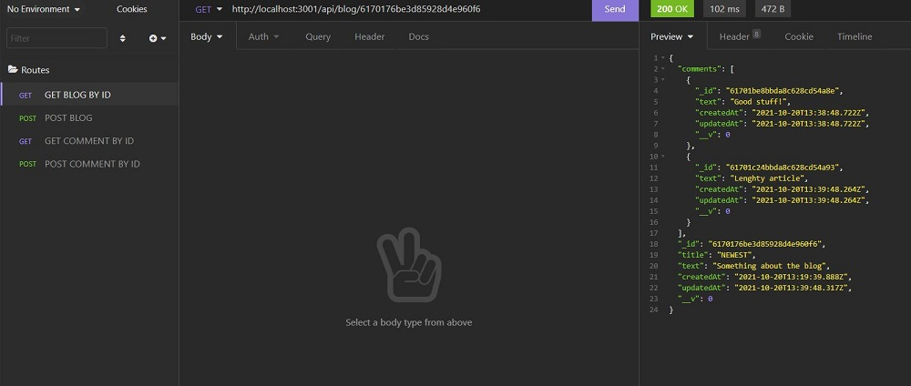

#node_backend_sample

   

Demonstration of GET & POST Comment endpoints added:

* [Insomnia Demo](https://watch.screencastify.com/v/yJxo9mllnHHQkXGS0CAx)

## Description
Added commenting functionality to an existing Node.js app, using Express Framework, Mongoose, and data stored in a Mongo database, by adding two new additional endpoints.

1) Post Comment at /blog/post/{id}/comment

2) Get Comment at /blog/post/{id}/comment

## User Story
AS AN engaging fan of reading blogs,

I WANT to be able to view and create comments for a blog,

SO THAT I can express my thoughts regarding the content of the blog.

## Table Of Contents
* [Links](#links)

* [Installation](#installation)

* [Instructions](#instructions)

* [Screenshots](#screenshots)

* [License](#license)

## Links
[GitHub Repo](https://github.com/asantercureton/node_backend_sample)

## Installation
Run "npm install" at root directory

Then run "npm run seed"

## Instructions
Run "npm start" to intiate the application.

## Screenshots
Below is a screenshot of the project:

## License

---
© 2021 NoSQL Node Backend Sample App.